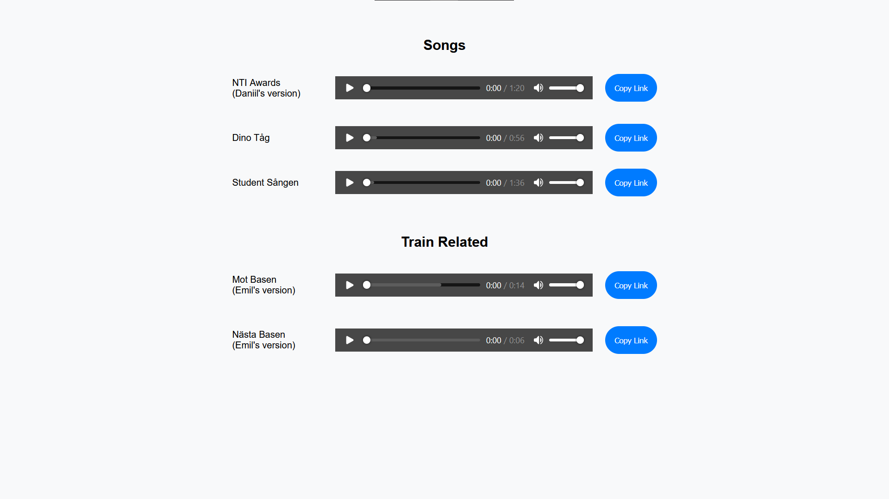

# Audio Hosting For Minecraft Server

Hosted on [GitHub Pages](https://viggostrom.github.io/Audio-Host-Service-MC/).

## Description
Some friends and I have a modded Minecraft server. We have a mod that adds a radio that allows us to play audio files from URLs. So to be able to play anything, we need to host the audio files somewhere. This is a simple web service that allows us to upload audio files and get a URL to them.